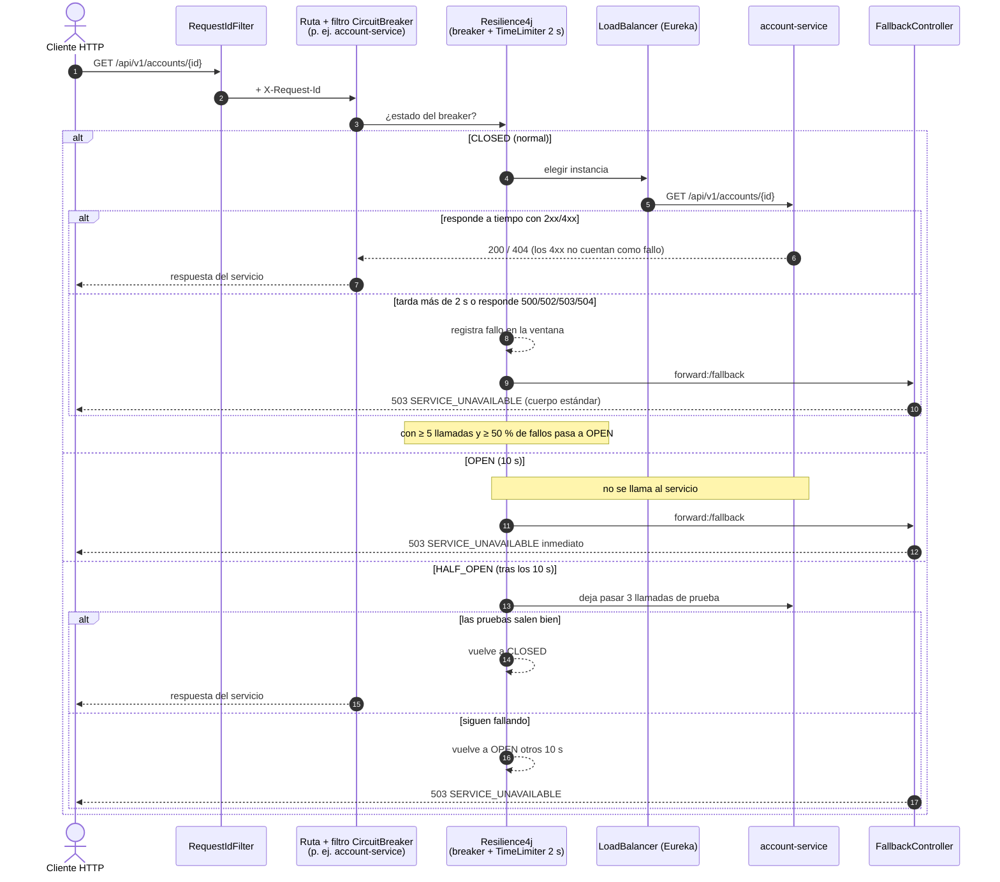

# Secuencia — Circuit breaker del Gateway (timeout, apertura, media apertura, cierre)

Implementado con el filtro `CircuitBreaker` de cada ruta (`bank-config/api-gateway.yml`),
`resilience4j.circuitbreaker.configs.default` / `timelimiter.configs.default` y
`FallbackController` (`/fallback` → 503). Lo prueba `CircuitBreakerTest` con el yml real.

Valores: ventana de 10 llamadas, mínimo 5, umbral 50 %, 10 s abierto, 3 llamadas en media apertura,
TimeLimiter 2 s, `statusCodes: [500, 502, 503, 504]` cuentan como fallo.

## Notas

- **Un breaker por servicio** (`customer-service`, `account-service`, …): si cae uno, las rutas de
  los demás siguen cerradas.
- **Operaciones de dinero.** En el 503 de una ruta de dinero (`MoneyOperations`) el mensaje avisa que
  el resultado es incierto y que se reintente con el **mismo** `operationId`; el servicio lo deduplica.
- **Sin reintentos en el Gateway ni en el balanceador** (`spring.cloud.loadbalancer.retry.enabled=false`):
  reintentar un POST de dinero lo decide el cliente, no la infraestructura.
- **Tope del cliente HTTP 3 s** (`httpclient.response-timeout`), siempre por encima de los 2 s del
  TimeLimiter, para que el corte lo haga el breaker y se cuente como fallo.
